# Worked examples from the annotation pass

The cases from the Aug 10 sync, with the actual charts this time. First the three
examples we went through, then all 13 instances where my blind annotation
disagreed with the judge. Verdicts and notes match `../annotation_scores.json`;
the flaw line is what the generator reported it changed.

## Cases from the sync

### 49d1c27a · wrong-title

The wrong-title pattern: the true title is quoted verbatim in the summary, which held for every wrong-title instance in the 100.

*Flaw:* Changed the plt.title string from 'Average Patent Processing Time by Jurisdiction and Applicant Type (2023)' to the factually wrong 'Annual Patent Fil …

| correct | flawed |
|---|---|
| 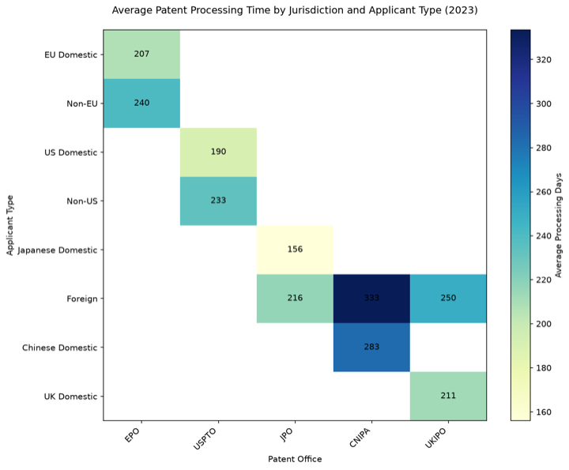 | 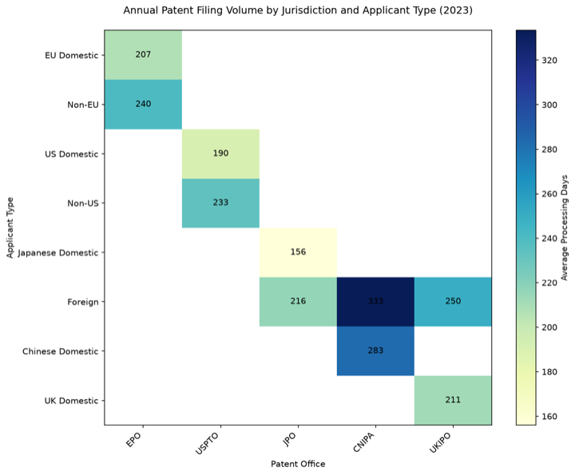 |

My call: **valid** · judge: valid
> The summary quotes the correct title verbatim, directly contradicting the injected wrong title about filing volume.

### 92c4925a · swapped-series

The subtle one: two stacked series swap their values, visible only as a small color shift in the stack. The summary still pins both series with explicit ranges.

*Flaw:* Swapped the value arrays of "Oil & Gas Eastern Europe" and "Heavy Machinery Eastern Europe" in the data dict, so each series now plots the other's val …

| correct | flawed |
|---|---|
|  | 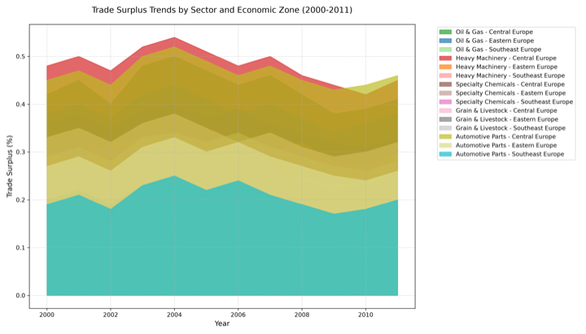 |

My call: **valid** · judge: valid
> The summary gives explicit value ranges for both swapped series (Oil & Gas Eastern Europe 0.28-0.34% and Heavy Machinery Eastern Europe 0.31-0.40%), which the flawed chart would plot inverted, contradicting the text and …

### 094d6db2 · wrong-chart-type

My one unsure: the KDE curves come back as dot chains. The summary says "curve" throughout, but the shape survives, so I left it at unsure.

*Flaw:* Replaced plt.plot(...) with plt.scatter(...) for the density curves, removing the line-only linewidth= keyword argument.

| correct | flawed |
|---|---|
| 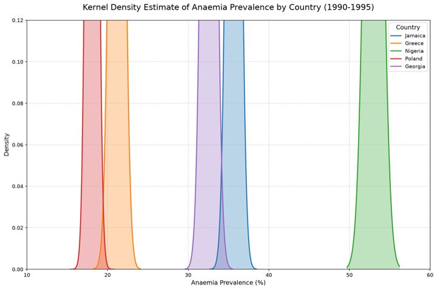 | 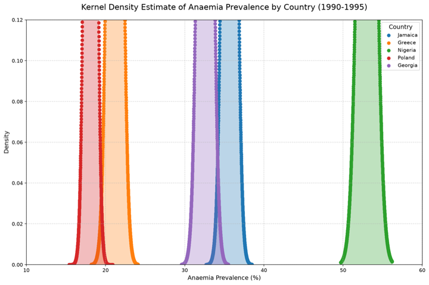 |

My call: **unsure** · judge: valid
> The summary describes continuous density curves with shaded areas, which contradicts a scatter-point rendering of the KDE data.

## The 13 disagreements (judge accepted, I rejected)

12 revolve around the seaborn missing-legend pattern from the sync: deleting the
legend call does not reliably remove a legend from the render, and where it does,
my bar for "identifiable without a legend" was stricter than the judge's. The
value case at the end is the one where the true value sits beyond the 15 CSV rows
the judge gets to see.

### 50386d3f · missing-legend

*Flaw:* Removed the `plt.legend(title='Country', bbox_to_anchor=(1.05, 1), loc='upper left')` statement from inside the subplot loop, leaving the countries' c …

| correct | flawed |
|---|---|
| 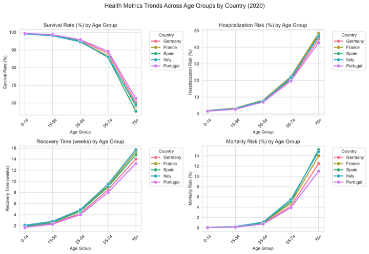 | 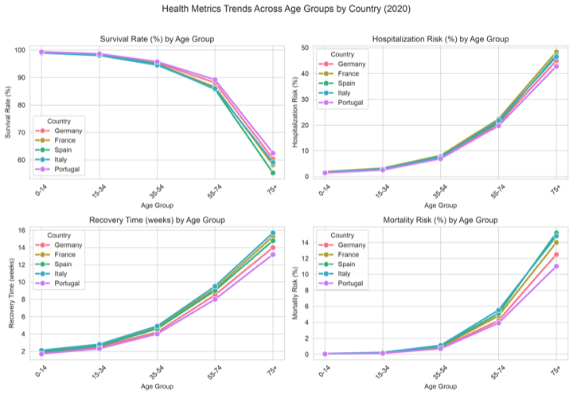 |

My call: **invalid** ("Just plotted inside") · judge: valid
> The summary explicitly maps each country to a color, which requires a legend to interpret; with the legend removed the color-country associations are unlabeled, contradicting the described identification.

### c7a6b6b3 · missing-legend

*Flaw:* Deleted the entire plt.legend(...) statement so the GDP Impact Category legend no longer appears, while the bars keep their original colours.

| correct | flawed |
|---|---|
| 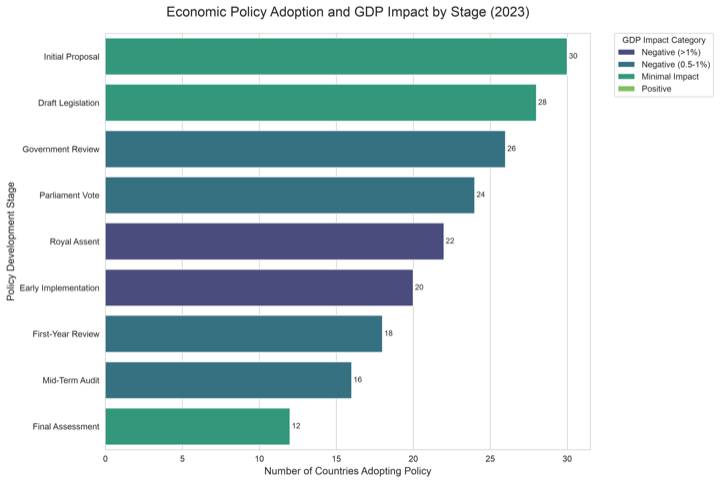 | 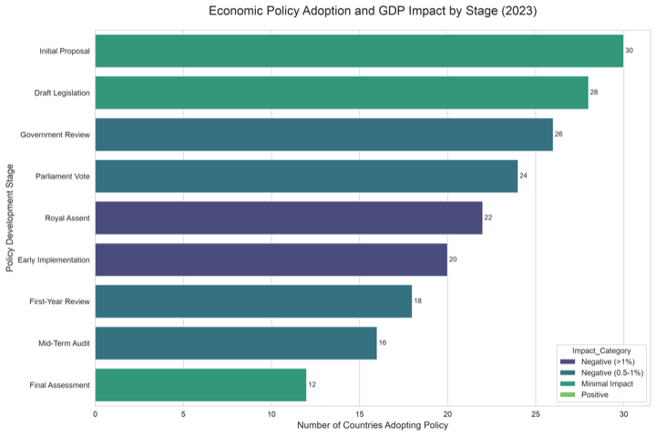 |

My call: **invalid** ("Not inside but outside, legend still visible") · judge: valid
> The summary explicitly states a legend is provided for the GDP impact categories, contradicting its deletion.

### 4a10167e · missing-legend

*Flaw:* Removed the plt.legend(...) call that assigned region names to the swarm plot colors, leaving the color-coded points without any identifying key.

| correct | flawed |
|---|---|
| 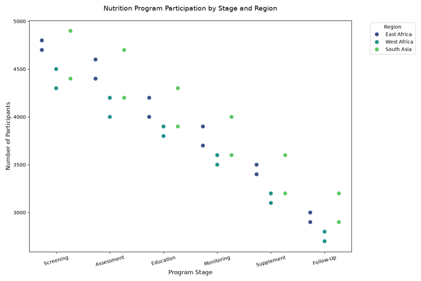 | 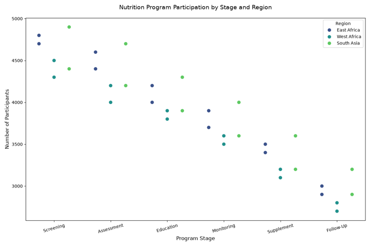 |

My call: **invalid** · judge: valid
> The summary explicitly describes a color-to-region mapping key, which the missing legend would fail to provide, exposing the flaw.

### 3e2a88de · missing-legend

*Flaw:* Removed the ax1.legend(...) call that identified the Risk Level box-plot categories (Low/Medium/High), leaving the box plot colors unlabeled while the …

| correct | flawed |
|---|---|
|  | 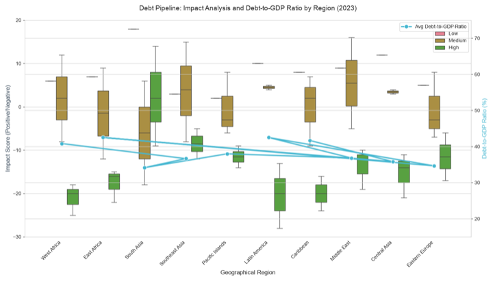 |

My call: **invalid** · judge: valid
> The summary explicitly describes the Risk Level color-coding for box plots, which the missing legend fails to identify.

### 956e603f · missing-legend

*Flaw:* Removed the plt.legend(...) call so the Increase/Decrease color coding is no longer explained by a legend.

| correct | flawed |
|---|---|
| 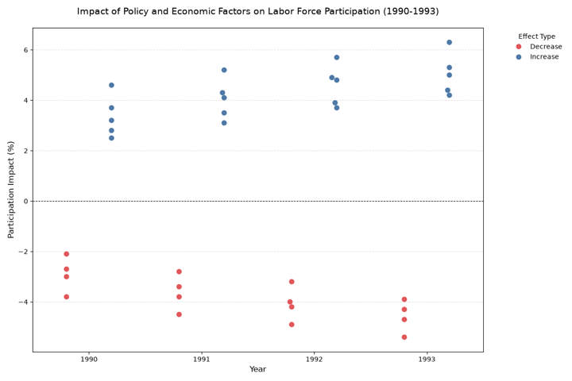 | 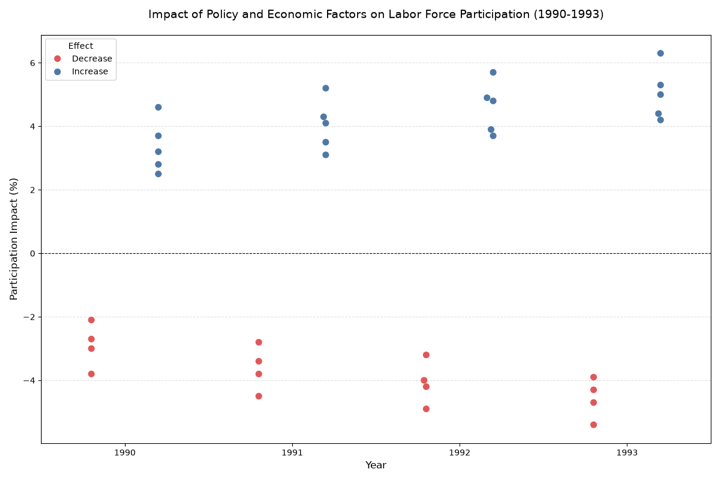 |

My call: **invalid** · judge: valid
> The summary states the chart distinguishes increases and decreases by blue and red dots, implying a color key that a missing legend would fail to provide, so the absence contradicts the described mapping.

### 034d9804 · missing-legend

*Flaw:* Removed the plt.legend(...) call that identifies the development-status/education-stage lines, leaving the plotted lines and colors unchanged but with …

| correct | flawed |
|---|---|
| 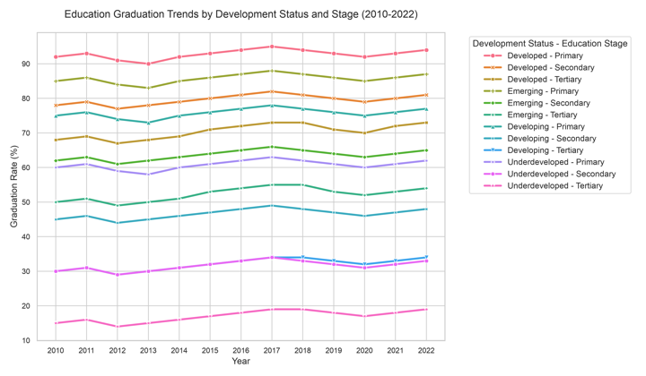 | 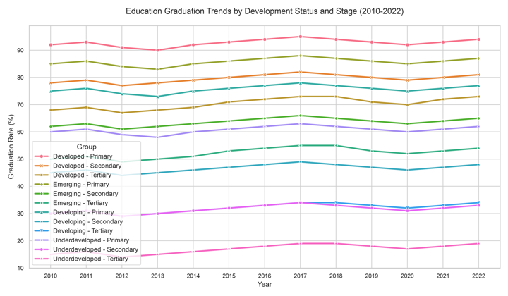 |

My call: **invalid** · judge: valid
> The summary explicitly states a legend on the right identifies the line combinations, which contradicts the removed legend.

### 30dd2f92 · missing-legend

*Flaw:* Removed the `plt.legend(title="Year", fontsize=9)` statement from the third subplot (line plot), so the 2022/2023 series can no longer be distinguishe …

| correct | flawed |
|---|---|
|  | 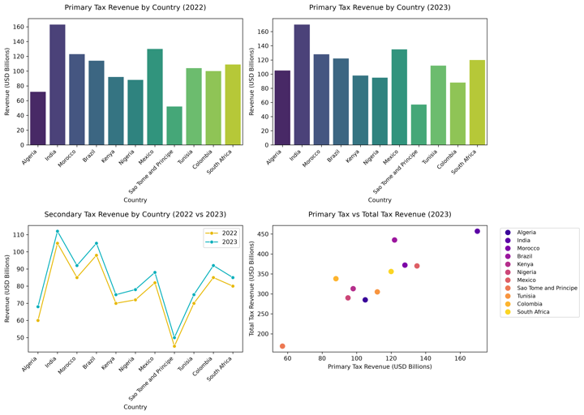 |

My call: **invalid** · judge: valid
> The summary states the line plot distinguishes two year series by color, implying a means (legend) to identify which line is 2022 vs 2023, which the missing legend removes.

### 3626c209 · missing-legend

*Flaw:* Removed the plt.legend(...) call that identified the Commodity_Type color coding, leaving the swarm plot's colored points unlabeled.

| correct | flawed |
|---|---|
| 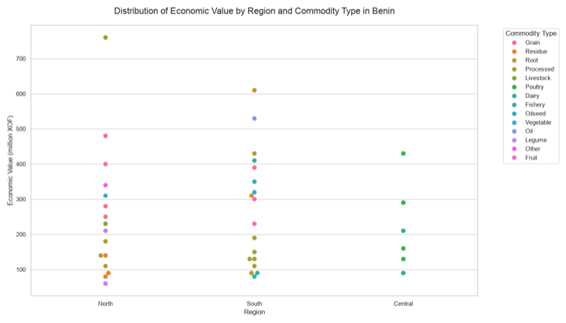 | 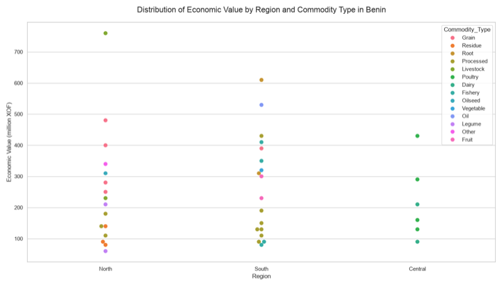 |

My call: **invalid** · judge: valid
> The summary explicitly describes a legend identifying the color-coded commodity types, which the flawed chart lacks.

### 7d8a6c8c · missing-legend

*Flaw:* Removed the standalone plt.legend(...) call that labeled the Impact Score Change color key, leaving the bars' colors unexplained while the drawn data …

| correct | flawed |
|---|---|
| 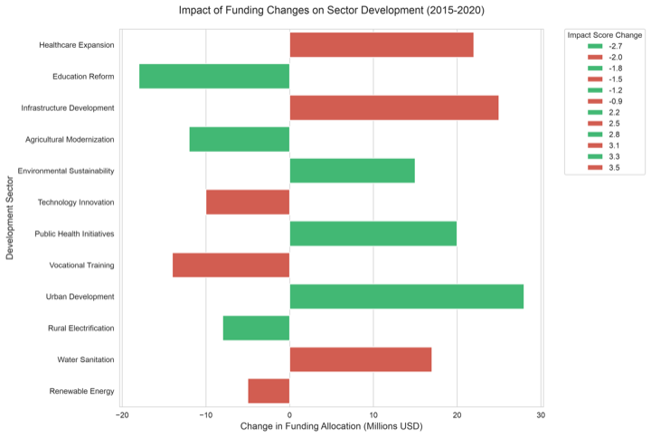 | 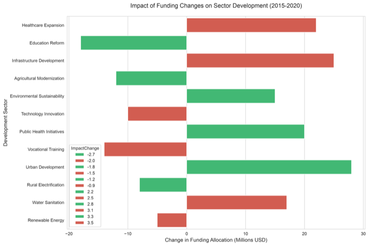 |

My call: **invalid** · judge: valid
> The summary explicitly describes a legend on the right side detailing impact score changes, which the flaw removed.

### 125ecf61 · missing-legend

*Flaw:* Removed the plt.legend(...) line that identifies which color/marker corresponds to each country, leaving the four lines drawn identically but without …

| correct | flawed |
|---|---|
| 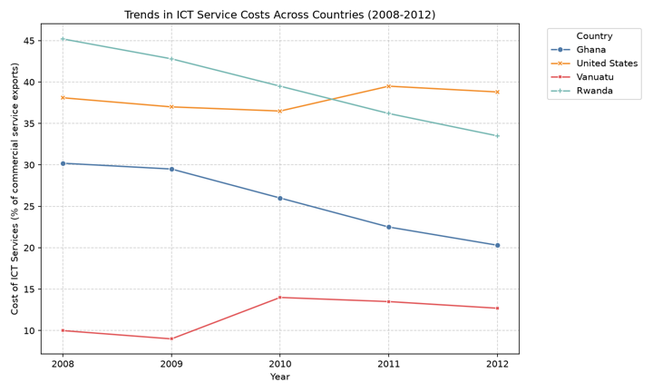 | 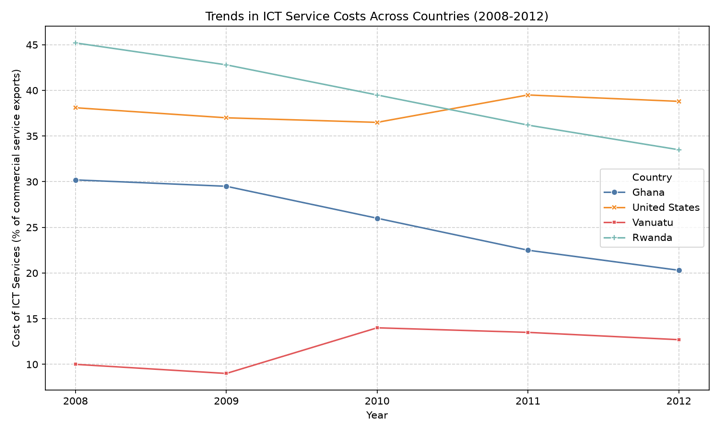 |

My call: **invalid** · judge: valid
> The summary explicitly states a legend is present in the upper right, contradicting the removed legend.

### 9628d990 · missing-legend

*Flaw:* Deleted the `plt.legend(title='Sector', bbox_to_anchor=(1.05, 1), loc='upper left')` statement so the sector color-coding legend no longer appears on …

| correct | flawed |
|---|---|
| 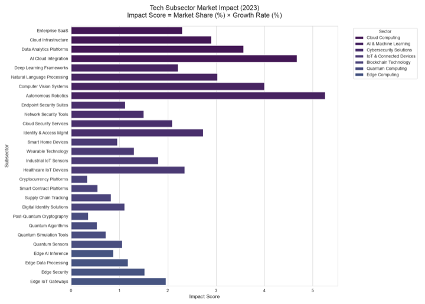 | 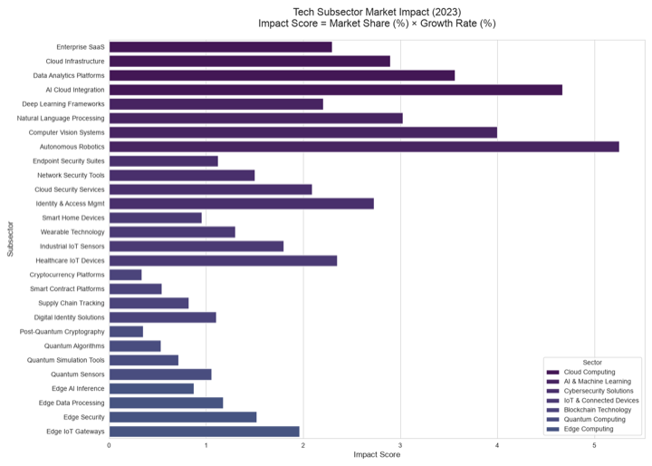 |

My call: **invalid** · judge: valid
> The summary explicitly states there is a legend on the right side indicating sector categories, which directly contradicts the missing legend.

### 253322e0 · missing-legend

*Flaw:* Removed the `plt.legend(title='Region', bbox_to_anchor=(1.05, 1), loc='upper left')` statement, eliminating the legend that identifies the region colo …

| correct | flawed |
|---|---|
| 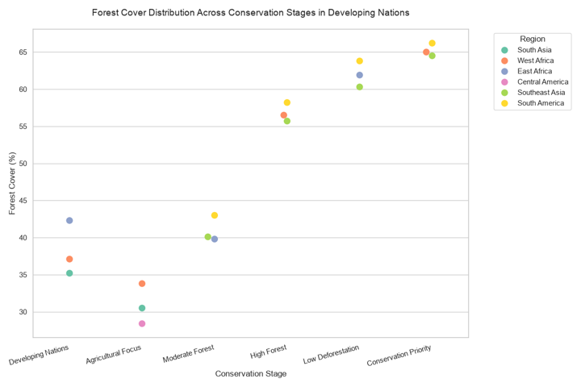 | 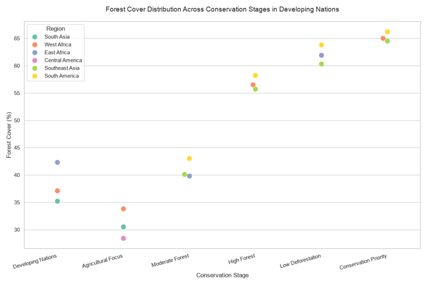 |

My call: **invalid** · judge: valid
> The summary explicitly states a legend on the right identifies the color-coded regions, directly contradicting the removed legend.

### c6cfca83 · value-perturbation

*Flaw:* Changed the Healthcare_Index value for Moron from 60 to 96 (a 1.6x inflation), causing that data point on the red dashed healthcare-index line to be p …

| correct | flawed |
|---|---|
| 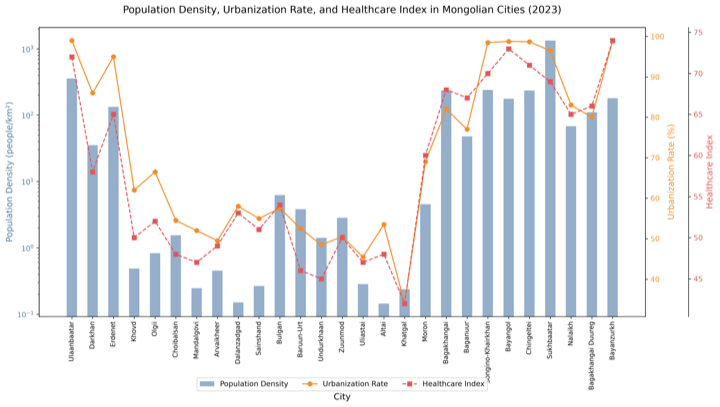 | 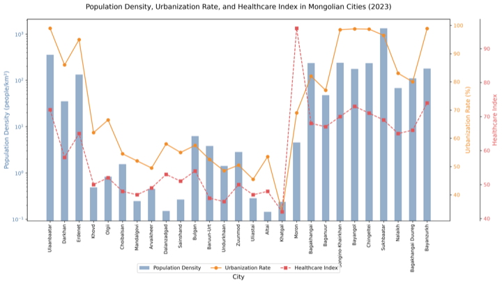 |

My call: **invalid** ("Moron not in Table") · judge: valid
> The summary states the healthcare index maxes out at 74, so a plotted value of 96 for Moron clearly contradicts the stated range, and the table's true value of 60 for Moron further exposes it.
